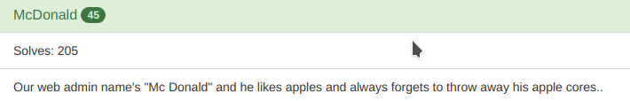
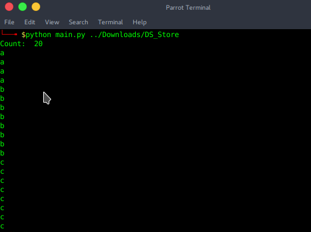
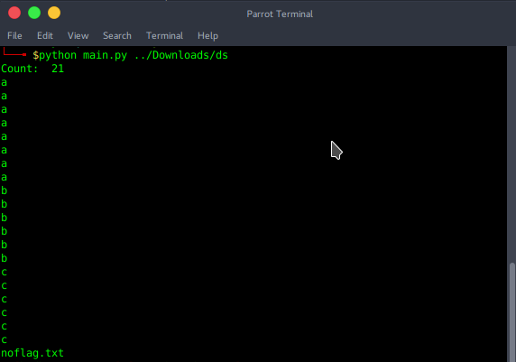
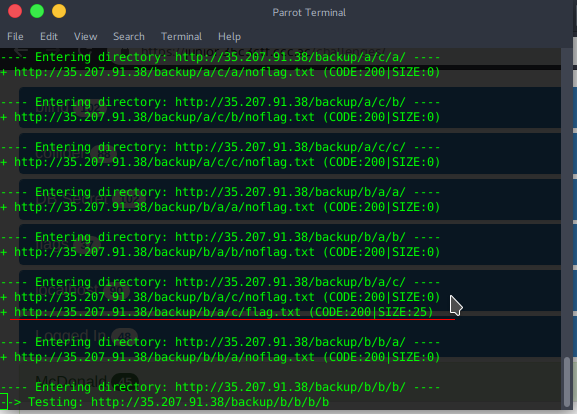

# McDonald

## Description

Our Web Admin name's "McDonald" and he likes apples and always forgets to throw away his apple cores.

Difficulty: Easy

Category : Web

## Challenge
http://35.207.91.38

## Writeup

To Start with We're presented with a static webpage which has nothing . So I first Checked for robots.txt and yeahh it was there. It contained a url /backup/.DS_Store which had a file DS_Store. Then I searched a bit about DS_Store(these r the files related to APPLE ie. it stores custom attributes of its containing folder , meaning we can list the files and subdirectory of a directory in which a .DS_Store is present). Then found this https://github.com/gehaxelt/Python-dsstore/ (A parser for Apple's .DS_Store). 

Ran __main.py__ for the /backup/.DS_Store and Got this 
. 

We got the subdirectories under /backup. Then i tried to look for more .DS_Store files under /backup/a , /b , /c.
Got a ds_store for /backup/b . Again ran main.py nd This time got this __INTERESTING :P__ 

.

Got a noflag.txt huh! ..... Got there but nothing (a troll), yet we got the subdirectories for /backup/b/ . So I repeated this process for looking .DS_Store under the directories, but nothing :( ... So the Endgame was I made a wordlist containing the words __a,b,c,noflag.txt,flag.txt__ and ran again ran __dirb__ with the new wordlist. Surprisingly there was a flag.txt under /backup/b/a/c/flag.txt 

Went to the URL and BOOOM....Flag was there ...

## 35c3_Appl3s_H1dden_F1l3s

Hope the Writeup wasn't too long.... :P

